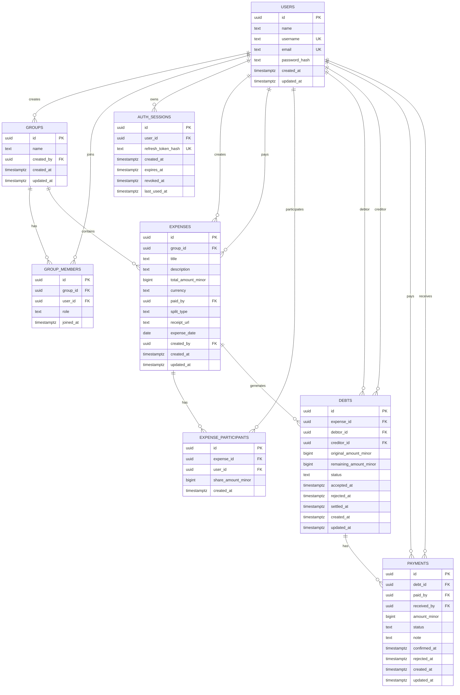

# Database ER Diagram
## Shared Expense & Debt Tracking App

This document defines the production database model for the Shared Expense & Debt Tracking App.

Design principles:
- PostgreSQL is the source of truth for data integrity.
- Monetary values are stored as integer minor units, not floating point or decimal business values.
- State transitions are enforced by application services and protected by database constraints where practical.
- Historical expense, debt, and payment records are retained for audit purposes.

---

## 1. Entity Relationship Diagram



---

## 2. Table Rules

### users

Required constraints:
- `id uuid primary key default gen_random_uuid()`
- `name text not null`
- `username text not null`
- `email text not null`
- `password_hash text not null`
- `created_at timestamptz not null default now()`
- `updated_at timestamptz not null default now()`
- `unique (username)`
- `unique (email)`
- `check (username = lower(username))`
- `check (username ~ '^[a-z0-9_]{3,30}$')`
- `check (email = lower(email))`
- `check (length(name) between 1 and 120)`

Application rule:
- Normalize username and email to lowercase before insert/update.
- Usernames are the product-facing identifier for user search and group member addition.

### auth_sessions

Required constraints:
- `id uuid primary key default gen_random_uuid()`
- `user_id uuid not null references users(id) on delete restrict`
- `refresh_token_hash text not null`
- `created_at timestamptz not null default now()`
- `expires_at timestamptz not null`
- `revoked_at timestamptz null`
- `last_used_at timestamptz null`
- `unique (refresh_token_hash)`
- `check (expires_at > created_at)`

Application rules:
- One row represents one logged-in client/device session.
- Store only a hash of the refresh token, never the raw refresh token.
- Login and registration create an active session.
- Refresh-token rotation updates the stored refresh token hash for the session.
- Logout revokes the current session by setting `revoked_at`.
- A session is inactive when `revoked_at is not null` or `expires_at <= now()`.
- Access tokens must reference an active session before protected routes are served.

### groups

Required constraints:
- `id uuid primary key default gen_random_uuid()`
- `name text not null`
- `created_by uuid not null references users(id) on delete restrict`
- `created_at timestamptz not null default now()`
- `updated_at timestamptz not null default now()`
- `check (length(name) between 1 and 120)`

### group_members

Required constraints:
- `id uuid primary key default gen_random_uuid()`
- `group_id uuid not null references groups(id) on delete cascade`
- `user_id uuid not null references users(id) on delete restrict`
- `role text not null default 'member'`
- `joined_at timestamptz not null default now()`
- `unique (group_id, user_id)`
- `check (role in ('owner', 'member'))`

Application rule:
- Group creator must also be inserted as an `owner` member in the same transaction that creates the group.

### expenses

Required constraints:
- `id uuid primary key default gen_random_uuid()`
- `group_id uuid not null references groups(id) on delete restrict`
- `title text not null`
- `description text null`
- `total_amount_minor bigint not null`
- `currency text not null default 'THB'`
- `paid_by uuid not null references users(id) on delete restrict`
- `split_type text not null`
- `receipt_url text null`
- `expense_date date null`
- `created_by uuid not null references users(id) on delete restrict`
- `created_at timestamptz not null default now()`
- `updated_at timestamptz not null default now()`
- `check (length(title) between 1 and 160)`
- `check (total_amount_minor > 0)`
- `check (currency = 'THB')`
- `check (split_type in ('equal', 'manual'))`

Application rules:
- `created_by`, `paid_by`, and all participants must be members of the group.
- Expenses are immutable in the MVP after creation.
- Receipt URL, if provided, must be validated by application code.

### expense_participants

Required constraints:
- `id uuid primary key default gen_random_uuid()`
- `expense_id uuid not null references expenses(id) on delete restrict`
- `user_id uuid not null references users(id) on delete restrict`
- `share_amount_minor bigint not null`
- `created_at timestamptz not null default now()`
- `unique (expense_id, user_id)`
- `check (share_amount_minor > 0)`

Application rule:
- Sum of participant shares must equal `expenses.total_amount_minor`.

### debts

Required constraints:
- `id uuid primary key default gen_random_uuid()`
- `expense_id uuid not null references expenses(id) on delete restrict`
- `debtor_id uuid not null references users(id) on delete restrict`
- `creditor_id uuid not null references users(id) on delete restrict`
- `original_amount_minor bigint not null`
- `remaining_amount_minor bigint not null`
- `status text not null default 'pending'`
- `accepted_at timestamptz null`
- `rejected_at timestamptz null`
- `settled_at timestamptz null`
- `created_at timestamptz not null default now()`
- `updated_at timestamptz not null default now()`
- `unique (expense_id, debtor_id, creditor_id)`
- `check (debtor_id <> creditor_id)`
- `check (original_amount_minor > 0)`
- `check (remaining_amount_minor >= 0)`
- `check (remaining_amount_minor <= original_amount_minor)`
- `check (status in ('pending', 'accepted', 'rejected', 'partially_settled', 'settled'))`

Application rules:
- Debt rows are generated from expense participants, excluding the payer.
- Debt status changes must follow the debt state machine in the implementation guide.
- A group owner can review a rejected debt and resend it by moving it back to `pending`.
- During review/resend, the owner may adjust `original_amount_minor`; `remaining_amount_minor` is reset to match the resent amount.
- Review/resend clears `accepted_at`, `rejected_at`, and `settled_at`.
- Dashboard totals use `remaining_amount_minor`.

### payments

Required constraints:
- `id uuid primary key default gen_random_uuid()`
- `debt_id uuid not null references debts(id) on delete restrict`
- `paid_by uuid not null references users(id) on delete restrict`
- `received_by uuid not null references users(id) on delete restrict`
- `amount_minor bigint not null`
- `status text not null default 'pending_confirmation'`
- `note text null`
- `confirmed_at timestamptz null`
- `rejected_at timestamptz null`
- `created_at timestamptz not null default now()`
- `updated_at timestamptz not null default now()`
- `check (paid_by <> received_by)`
- `check (amount_minor > 0)`
- `check (status in ('pending_confirmation', 'confirmed', 'rejected'))`

Application rules:
- `paid_by` must equal the debt debtor.
- `received_by` must equal the debt creditor.
- Payment status changes must follow the payment state machine in the implementation guide.
- Only one `pending_confirmation` payment is allowed for a debt at a time.
- Pending plus confirmed payments must not exceed the debt's current `remaining_amount_minor`.
- Users may list only payments where they are `paid_by` or `received_by`.

---

## 3. Required Indexes

Recommended indexes for core flows:

```sql
create index idx_group_members_user_id on group_members(user_id);
create index idx_users_username_search on users(username text_pattern_ops);
create index idx_expenses_group_date on expenses(group_id, expense_date desc, created_at desc);
create index idx_expense_participants_user_id on expense_participants(user_id);
create index idx_debts_debtor_status on debts(debtor_id, status);
create index idx_debts_creditor_status on debts(creditor_id, status);
create index idx_debts_expense_id on debts(expense_id);
create index idx_auth_sessions_user_active on auth_sessions(user_id, revoked_at);
create index idx_payments_debt_status on payments(debt_id, status);
create index idx_payments_paid_by on payments(paid_by);
create index idx_payments_received_by on payments(received_by);
```

---

## 4. Delete Behavior

MVP delete behavior:
- Users are not hard-deleted.
- Auth sessions are revoked, not hard-deleted, during normal logout flows.
- Expenses, debts, and payments are not deleted by user actions.
- Group deletion is out of MVP scope.

Foreign key behavior:
- Use `on delete restrict` for financial history tables.
- Use `on delete cascade` only for membership rows when a group is deleted by an administrative or future lifecycle operation.

---

## 5. Notes for Migrations

Required extension:

```sql
create extension if not exists pgcrypto;
```

Use `gen_random_uuid()` for primary keys.

Use `timestamptz` for timestamps.

Use `BIGINT` minor units for all monetary values:
- THB 1.00 is stored as `100`.
- THB 10.50 is stored as `1050`.
